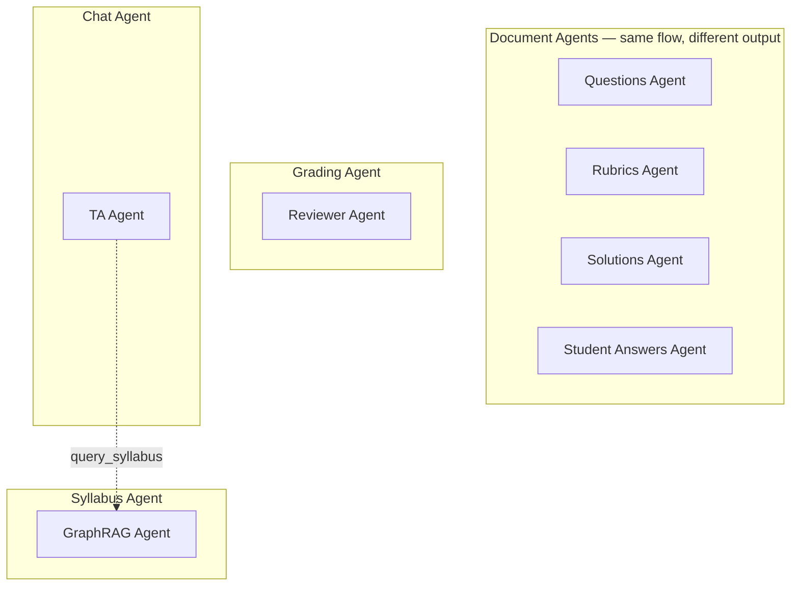
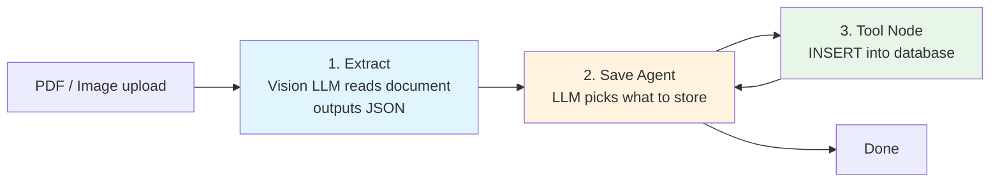
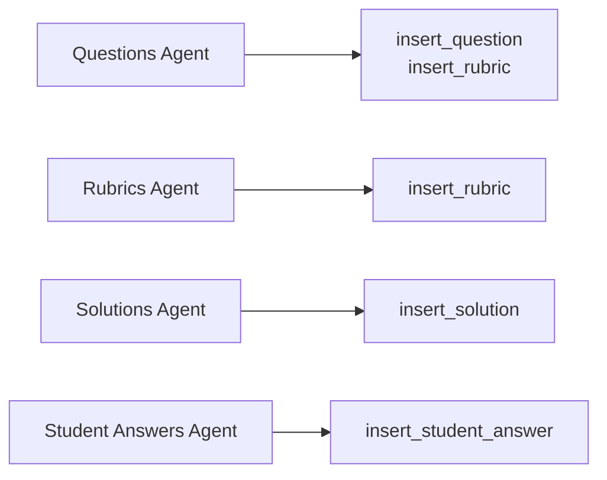
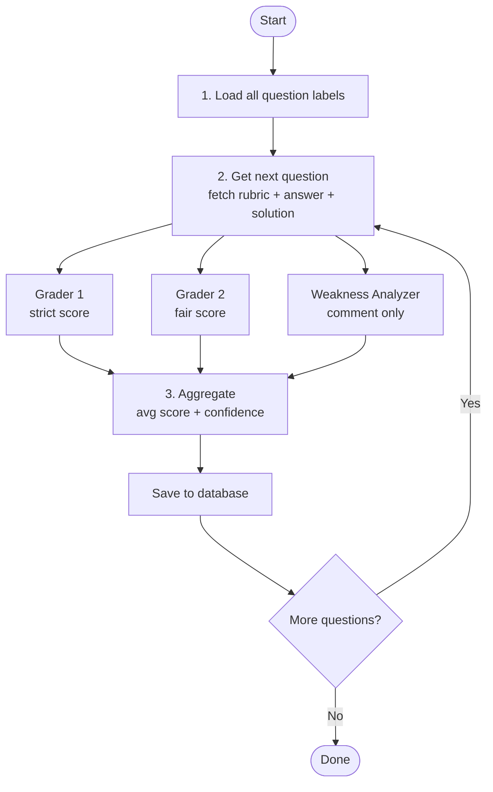
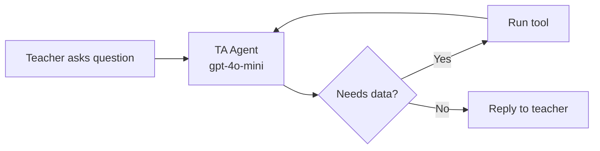
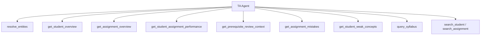
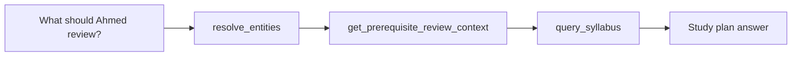
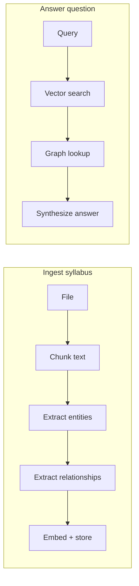

# AI Agent System — Diagrams Only

---

## All Agents Overview

---

## Document Agents — How They Work

Same pattern for Questions, Rubrics, Solutions, Student Answers.

### What each agent saves

---

## Grading Agent — How It Works

---

## TA Agent — How It Works

### Tools TA can call

### Example: study plan question

---

## GraphRAG Agent — How It Works

